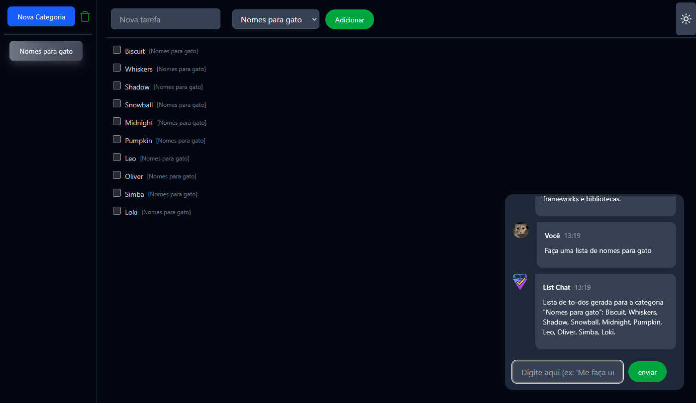

<p align="center">
  
</p>

# 📝 To-Do with IA

A modern to-do list application built with React, TypeScript, Vite, and Dexie (IndexedDB), featuring category management, persistent storage, and AI-powered task suggestions using Gemini.

## ✨ Features
- ✅ Add, complete, and delete tasks
- 🗂️ Organize tasks by categories
- ➕ Create and delete categories
- 💾 Persist data locally (IndexedDB)
- 🤖 AI chatbot (Gemini) for generating tasks and categories
- 🌗 Dark/light theme toggle
- 📱 Responsive and modern UI

## ⚡ Technologies
- ⚛️ React 19
- 🟦 TypeScript
- ⚡ Vite
- 🗄️ Dexie (IndexedDB)
- 🎨 TailwindCSS
- 🤖 Gemini AI (Google Generative AI)

## 🚀 Getting Started

### 📦 Prerequisites
- Node.js >= 18
- npm >= 9

### 🛠️ Installation
```bash
npm install

### Installation
```bash
npm install
```

### Running the App
```bash
npm run dev
```

Open [http://localhost:5173](http://localhost:5173) in your browser.

## Project Structure
```
src/
  App.tsx            # Main app component
  db.ts              # Dexie database setup
  chatbot.ts         # Gemini AI integration
  hooks/             # Custom hooks (useTodos, useCategory)
  components/        # UI components
  context/           # Theme provider
  themes/            # Button themes
  types/             # TypeScript types
  utils/             # Utility functions
public/              # Static assets
```

## Environment Variables
Create a `.env` file with your Gemini API key:
```
VITE_REACT_APP_GEMINI_API_KEY=your_gemini_api_key
```
